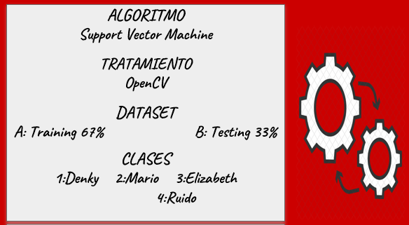
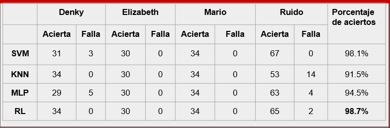

## Proyecto Académico con Reconocimiento de Patrones -IA ##
## PROBLEMÁTICA ## 
Inseguridad ciudadana: principal problema a nivel latinoamérica.
29.5% fue víctima algún hecho delictivo.
Solo el 25% es denunciado. 
Consecuencia: Obstaculiza el crecimiento económico.
Iniciativa: Programa de recompensas.
Finalidad: ofrecer dinero a cambio de información.

## OBJETIVOS ##
Desarrollar un software de reconocimiento facial que sea capaz de reconocer a las personas requisitoriadas a nivel del departamento de Apurimac.
Diseñar un software que sea capaz de procesar imágenes de diferentes tamaños.
Implementar el software que sea capaz de procesar imágenes en busca de personas requisitoriadas.
Implementar el software que sea capaz de procesar video (webcam) en tiempo real.

## METODOLOGÍA ##
El dataset de las imágenes y el csv generado de estas imágenes se encuentra
en el siguiente [link](https://drive.google.com/drive/folders/1IWyhG8DZOhrAiXm_JtxEo2T7y6m4_aZr?usp=sharing) 
Para el tratamiento de las imágenes se utilizó OpenCV utilizando 67 % de datos de entrenamienyo y 33 % de prueba, 
como variables a predecir fueron imágenes de rostro de mi persona, de dos compañeros de grupo y por último el ruido.
Utilizamos tres algoritmos de Clasificación y una Red Neuronal.

## PRUEBAS ##
Comparación de algoritmos utilizados por el entrenamiento

## RESULTADOS ## 

El sistema de recompensas.pe en extension .exe o EJECUTABLE, se encuentra en el siguiente [link](https://drive.google.com/drive/folders/18__86Wrsghzohc6Ugx0rmT57QkgLmQtT?usp=sharing) para ejecutarlo de manera local.

También,algunas fotos para probar en el sistema de recompensas.pe, en el siguiente [link](https://drive.google.com/drive/folders/1JT_nFaBwLn5m3GpaBjRoK7i1ko_CE01l?usp=sharing)
se muestra algunas fotos para probar el sistema. 
